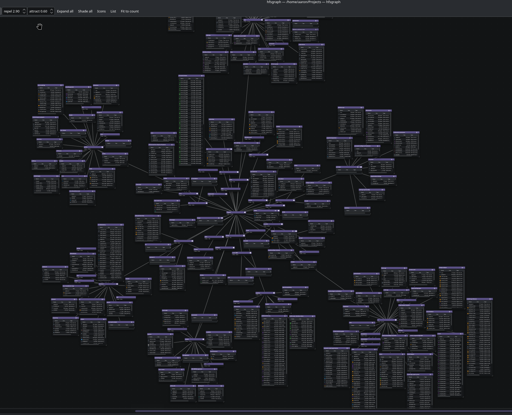

# hfsgraph

A canvas tool for **re-wiring a directory hierarchy to match its semantic structure**.

A hierarchical filesystem forces one rigid tree onto your files, but you think
semantically and multi-dimensionally. hfsgraph makes the semantic layer visible — groups,
colors, associations drawn on a node-graph canvas alongside the real directory tree — and
lets you re-align the physical structure to match, through a *propose → verify → commit*
workflow over `mv` (nothing touches disk until you Apply).



*A real, organically-grown `~/Projects` (~6,000 directories) rendered as a converged
force-directed graph: each directory is a card, edges are containment, and clusters fall
out of the layout.*

## Where things are

| What | Where |
|------|-------|
| Full concept / design | [`CONCEPT.md`](CONCEPT.md) |
| Architecture decisions | [`docs/architecture/`](docs/architecture/) — `make adr CMD="list --group"` |
| Tasks (build/lint/test) | `make help` |

## Stack

Standalone **Qt6 + KDE Frameworks 6** desktop app (C++) — no embedded webview, no
client/server, launches and exits. Native KDE theming and controls; `QGraphicsView` canvas;
`KF6::Solid` for mount/device detection, `KF6::Baloo` + `user.xdg.tags` for tag interop,
`libbtrfsutil` for snapshots. See [ADR-400](docs/architecture/platform/) for the rationale.

## Quick start

Requires Qt6, KDE Frameworks 6, extra-cmake-modules, and a C++20 compiler.

```sh
make help     # list tasks
make build    # configure + compile (CMake)
make run      # launch
make check    # lint + test + ADR lint
make adr CMD="list --group"
```

## Status

Early. A working **read-only graph viewer**: directories as cards on a force-directed
canvas (physics toggle, repel/attract controls, box collision), window-shade nodes with a
file browser (icon grid ↔ detail), and bulk controls. The *re-wiring* engine (propose →
verify → commit over `mv`) is the next phase — see `.claude/TODO.md` and `CONCEPT.md`.

## License

GPL-3.0-or-later — see [`LICENSE`](LICENSE). Chosen to align with the KDE ecosystem this
app is built on (Qt6 / KDE Frameworks).
